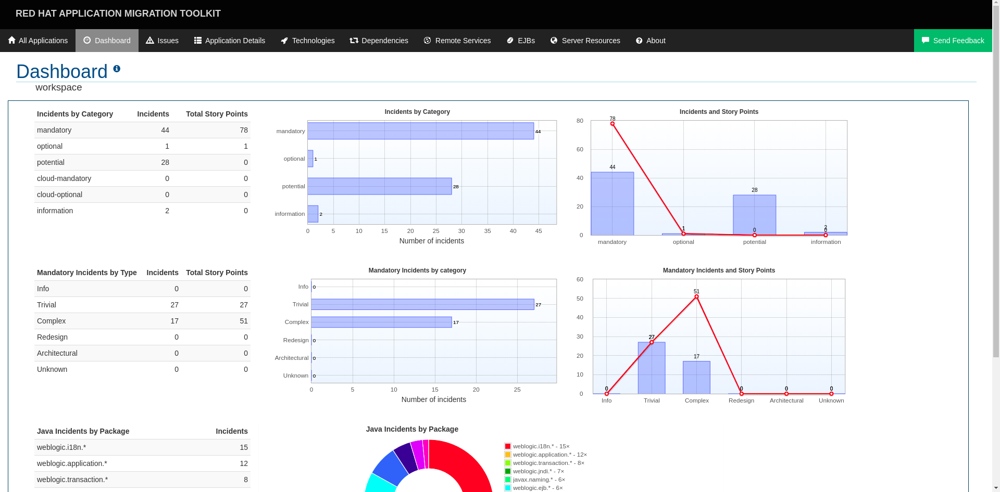

# Migration Toolkit for Applications - Action

A Github Action that will execute an analysis to the content of your repository using [Migration Toolkit for Applications](https://developers.redhat.com/products/rhamt/overview).

> The Migration Toolkit for Applications (MTA) is an assembly of tools that support large-scale Java application modernization and migration projects across a broad range of transformations and use cases. It accelerates application code analysis, supports effort estimation, accelerates code migration, and helps you move applications to the cloud and containers.

## Usage

To integrate [Migration Toolkit for Applications](https://developers.redhat.com/products/rhamt/overview) with your GH Actions pipeline, specify the name of this repository with a tag number as a `step` within your `ẁorkflow.yml` file.

inside your `.github/workflows/workflow.yml` file:

```yaml
steps:
  - uses: actions/checkout@v2
  - uses: carlosthe19916/windup-action@master
    id: rhamt
    with:
      target: eap7
      input: myInput #(Optional) Default value $GITHUB_WORKSPACE
      output: myOutput #(Optional) Default value ${GITHUB_WORKSPACE}.report
      additional-command-line-arguments: "--sourceMode" #(Optional) You can define all commands available in Migration Toolkit for Applications
```

## Arguments

MTA Action, accepts 4 different arguments:

| Input                             |                                                   Description                                                   |    Usage |
| --------------------------------- | :-------------------------------------------------------------------------------------------------------------: | -------: |
| target                            |                              The target technology for the application migration.                               | Required |
| input                             | A space-delimited list of the path to the file or directory containing one or more applications to be analyzed. | Optional |
| output                            |              Specify the path to the directory to output the report information generated by MTA.               | Optional |
| additional-command-line-arguments |                                       Additional Command-line Arguments.                                        | Optional |

## Output

MTA - Action, has only one `output`:

- `report`: The **full path** of the compressed file that contains the report generated by MTA.

> NOTE: The `report` output variable is the **Full Path** but the filename is always `mta-report.tgz`

## Example `workflow.yml` with MTA Action

```yaml
name: Example workflow for MTA
on: [push]
jobs:
  run:
    runs-on: ubuntu-latest
    steps:
      - uses: actions/checkout@v2
      - uses: carlosthe19916/windup-action@master
        id: rhamt
        with:
          target: eap7
          additional-command-line-arguments: "--sourceMode"
```


